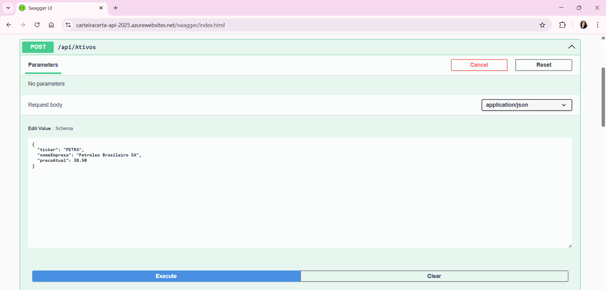
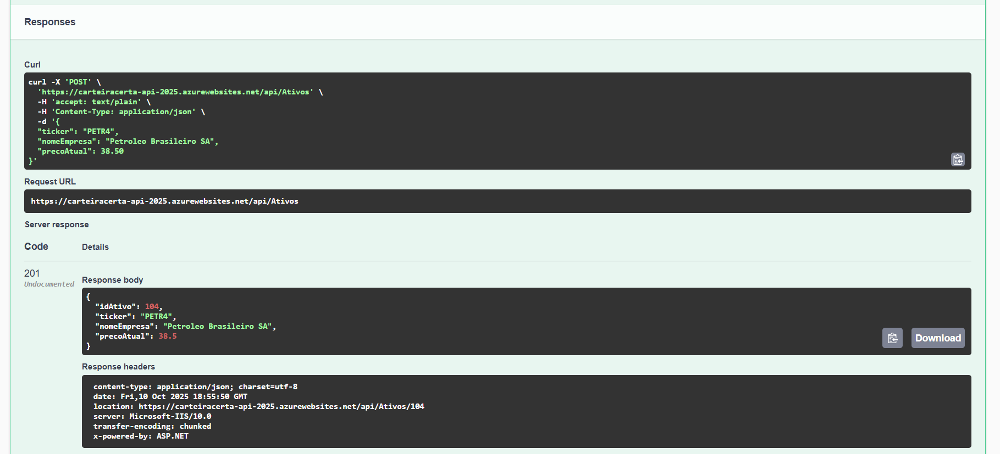
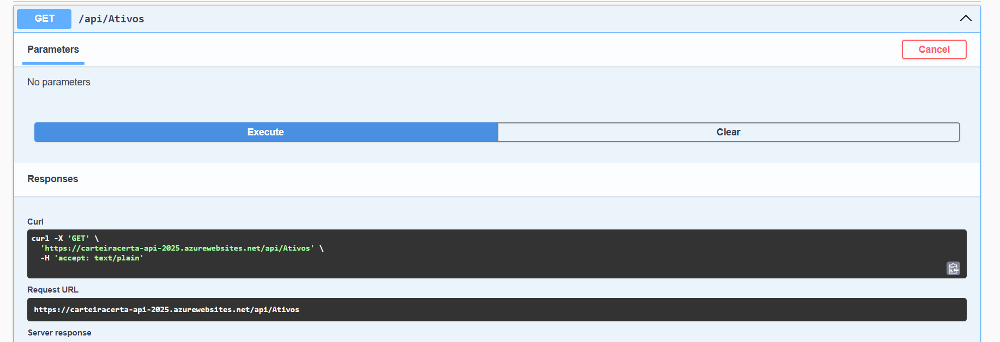
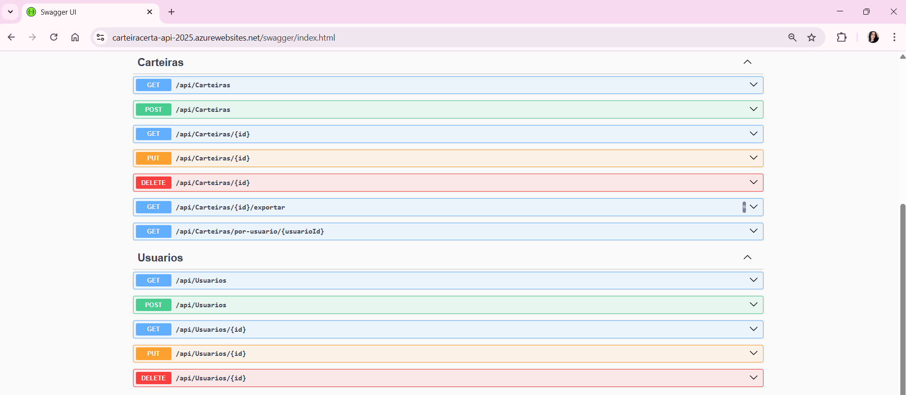
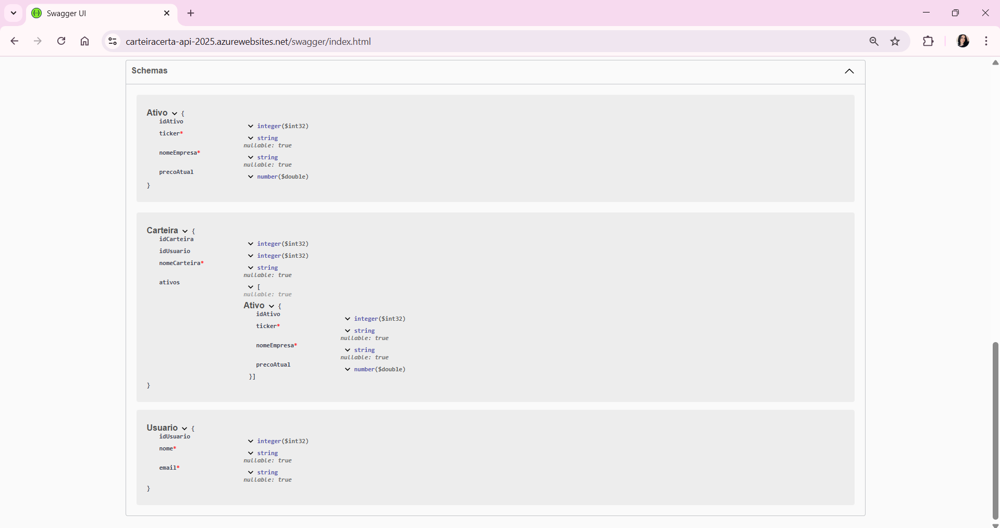
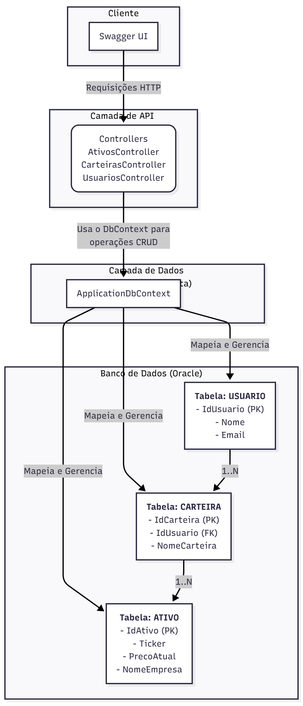

# 📚 Projeto CarteiraCerta by NexTech

Bem-vindo ao repositório da API **CarteiraCerta**, o backend desenvolvido pela equipe **NexTech** para transformar a curiosidade em conhecimento e abrir caminhos para novos investidores.

---

Por Eduardo Araujo (RM99758), Gabriela Trevisan (RM99500), Leonardo Bonini (RM551716) e Rafael Franck (RM550875)

---

## 🎯 O que é o Projeto CarteiraCerta?

O **CarteiraCerta** é uma **API RESTful** para uma aplicação de investimentos. A ideia, desenvolvida para o "Challenge FIAP/XP", é criar uma plataforma que guia investidores (principalmente os iniciantes), oferecendo recomendações personalizadas e facilitando o gerenciamento de seus ativos financeiros.

Esta API é a responsável por toda a lógica de negócio, manipulação de dados e comunicação com o banco de dados Oracle, além de se conectar a serviços externos para obter dados em tempo real.

---

## ⚙️ O que o Projeto Faz? (Funcionalidades)

Atualmente, a API CarteiraCerta possui as seguintes funcionalidades implementadas:

1.  **Gerenciamento Completo (CRUD):**
    * Permite criar, ler, atualizar e deletar todas as entidades principais da aplicação (`Usuários`, `Carteiras` e `Ativos`) no banco de dados.

2.  **Pesquisas Avançadas com LINQ:**
    * Endpoints específicos para buscas, como filtrar ativos por ticker ou listar todas as carteiras de um determinado usuário.

3.  **Integração com API de Cotações em Tempo Real:**
    * Um endpoint que se conecta à API da Finnhub para buscar o preço atual e outras informações de qualquer ativo financeiro pelo seu ticker.

4.  **Exportação de Dados da Carteira:**
    * Oferece um endpoint que permite ao usuário exportar os detalhes de sua carteira para um arquivo `.json`, facilitando a portabilidade dos dados.
    
5.  **Publicação Contínua na Nuvem:**
    * O projeto está configurado com um pipeline de CI/CD via GitHub Actions que compila, testa e publica a API automaticamente no **Microsoft Azure**, garantindo que as atualizações sejam entregues de forma rápida e segura.

---

## 💡 Como Funciona? (O Fluxo de Dados)

1.  **Interface (Swagger UI):** Você interage com um endpoint, por exemplo, solicitando a cotação de um ativo.

2.  **API Controller (`AtivosController`):** A requisição chega ao controller, que entende a solicitação.

3.  **Lógica de Negócio:**
    * **Para CRUD:** O Controller usa o `DbContext` para traduzir o comando C# em SQL e interagir com o banco de dados Oracle.
    * **Para Cotações:** O Controller usa o `IHttpClientFactory` para fazer uma chamada HTTP à API externa da Finnhub, enviando a chave de API para autenticação.

4.  **Resposta:** Os dados (do banco Oracle ou da Finnhub) são retornados em formato JSON para a interface.

---

## 🛠️ Arquitetura e Tecnologias

O projeto foi construído utilizando uma arquitetura em 3 camadas:

-   `CarteiraCerta.Model`: Contém as classes de dados (`Usuario`, `Ativo`, `Carteira`).
-   `CarteiraCerta.Data`: Camada de acesso a dados, responsável pela comunicação com o banco via Entity Framework Core.
-   `CarteiraCerta.Api`: Expõe os endpoints RESTful para o cliente.

**Tecnologias Utilizadas:**
-   .NET 8
-   ASP.NET Core
-   Entity Framework Core 8
-   Oracle Database
-   Swagger/OpenAPI
-   Microsoft Azure (App Services)
-   GitHub Actions (CI/CD)

---

## 🚀 Como Executar e Testar o Projeto

### Testando na Nuvem (Ambiente Publicado)

A maneira mais fácil de testar é através do ambiente já publicado no Microsoft Azure.

1.  **Acesse a Interface do Swagger:**
    * Abra o navegador e acesse a URL da aplicação: **`https://carteiracerta-api-2025.azurewebsites.net/swagger/index.html`**

2.  **Teste os Endpoints:**
    * **Para testar a cotação de um ativo:**
        * Expanda o endpoint `GET /api/Ativos/cotacao/{ticker}`.
        * Clique em **"Try it out"**.
        * Digite um ticker (ex: `PETR4`, `MGLU3`) e clique em **"Execute"**.
        * Observe a resposta com os dados em tempo real.

### Executando Localmente

Siga os passos abaixo para rodar a API em sua máquina local.

**Pré-requisitos:**
* .NET 8 SDK instalado.
* Acesso a um banco de dados Oracle.
* Uma chave de API da [Finnhub.io](https://finnhub.io).

**1. Preparação do Ambiente:**
* Clone o repositório.
* Abra o arquivo `CarteiraCerta.Api/appsettings.json`.
* Ajuste a `DefaultConnection` com suas credenciais do Oracle.
* Adicione sua chave da Finnhub na seção `Finnhub`.

**2. Executando e Testando:**
* Execute o comando `dotnet run` na pasta `CarteiraCerta.Api`.
* Acesse `http://localhost:<porta>/swagger` para testar.

---

## 🔐 Segurança e CI/CD

Este projeto integra práticas de segurança diretamente no pipeline de desenvolvimento (CI/CD) utilizando o GitHub Actions para identificar e mitigar vulnerabilidades de forma automatizada.

O pipeline é composto por SAST (CodeQL), DAST (OWASP ZAP) e SCA (Dependabot).

---

## 📸 Evidências de Funcionamento

Abaixo estão as evidências do funcionamento da API no ambiente do Microsoft Azure.

---

## 📝 Diagrama

